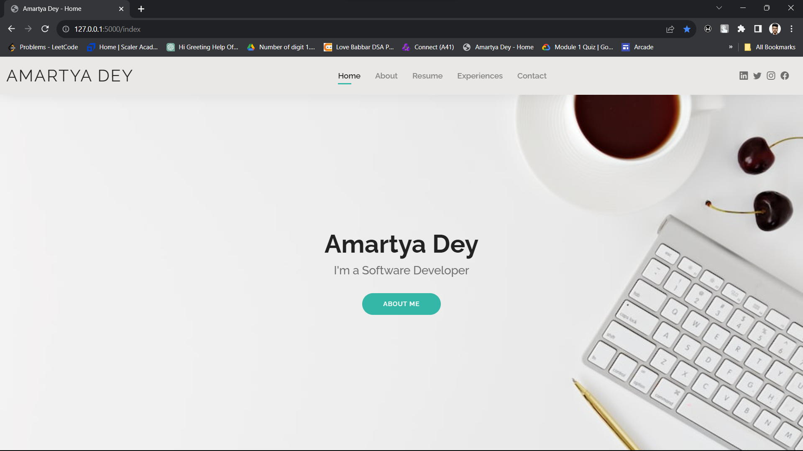
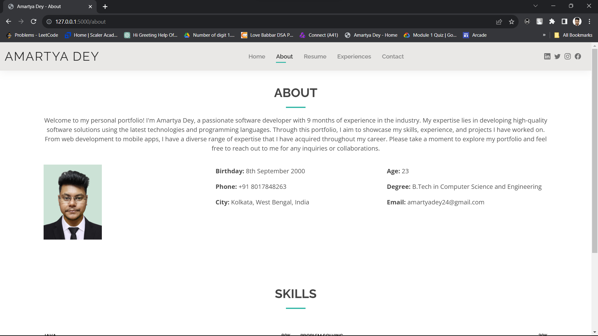
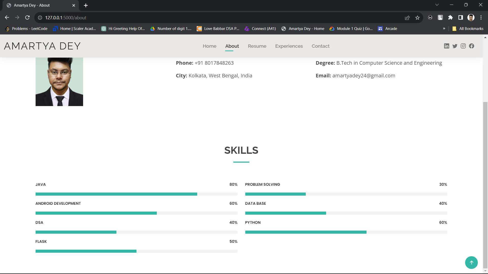
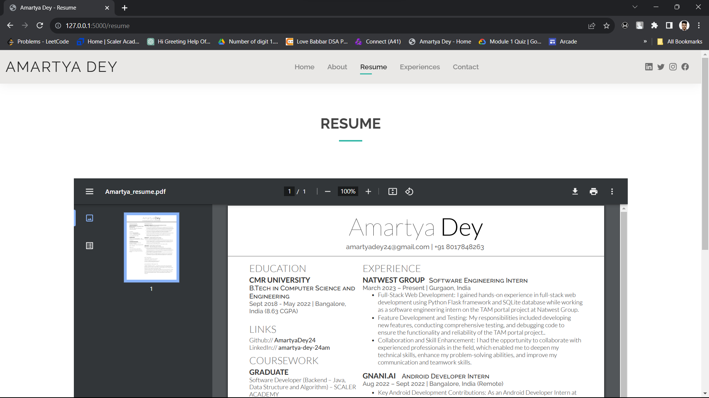
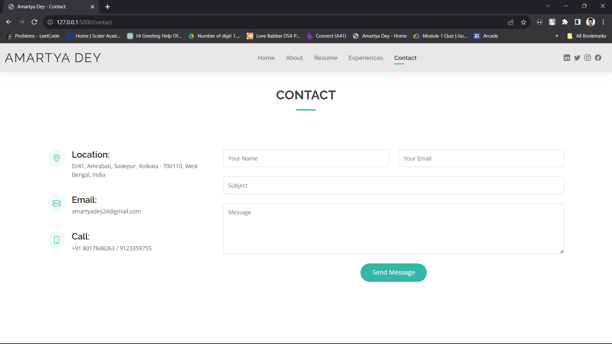

# My Personal Portfolio

Welcome to my personal portfolio! This project showcases my skills, experiences, and projects in the field of web development. The project is still under development so you can check in your local host.

## Table of Contents

- [About](#about)
- [Technologies Used](#technologies-used)
- [Getting Started](#getting-started)
- [Features](#features)
- [Screenshots](#screenshots)
- [Contributing](#contributing)
- [License](#license)

## About

This project serves as my personal website where I display my resume, highlight my skills, and share information about the projects I've worked on. It's built using Python, Flask, HTML, and CSS to provide an interactive and visually appealing experience for visitors.

## Technologies Used

- [Python](https://www.python.org/)
- [Flask](https://flask.palletsprojects.com/)
- HTML
- CSS

## Getting Started

To run this project locally, follow these steps:

1. Clone this repository:

   ```bash
   git clone https://github.com/AmartyaDey24/personal_portfolio.git

2. Navigate to the master branch:

   ```bash
   git checkout master
   
3. Activate the virtual environment:
   
   ```bash
   .\venv\Scripts\activate
   
5. Install the required dependencies:

   ```bash
   pip install flask
   
6. Start the Flask development server:

   ```bash
   python main.py
   
7. Open your web browser and visit http://localhost:5000 to view your portfolio locally.

## Features

- Responsive design for optimal viewing on various devices.
- Resume section with my career summary and education details.
- About section showcase a breif about myself and my respective skills.
- Contact form for visitors to get in touch with me.
- Experiences showcase my all the jobs and internship experiences so far.

## Screenshots







## Contributing

If you'd like to contribute to this project, please follow these steps:

- Fork the repository.
- Create a new branch for your feature: git checkout -b feature-name
- Make your changes and commit them: git commit -m "Add your feature"
- Push to the branch: git push origin feature-name
- Create a pull request on GitHub.


Thank you for visiting my portfolio!